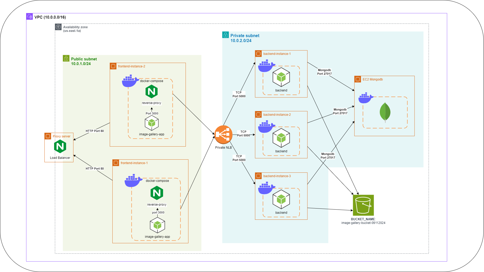

### Create an AWS Infrastructure for this app

[]

## Prerequisites:
- An AWS account
- Dockerhub account

## Steps:

1. Create a VPC:

Go to the VPC console in AWS.
Create a new VPC with a CIDR block of 10.0.0.0/16.
Create two subnets:
- Public subnet: CIDR block 10.0.1.0/24
- Private subnet: CIDR block 10.0.2.0/24
Enable Auto-Assign Public IP for the public subnet.

2. Create a Security Group:

Create a security group for your EC2 instances.
Allow inbound traffic on port 22 (SSH) for SSH access.
Allow inbound traffic on port 80 (HTTP) for web access.
Allow inbound traffic on port 6000 (MongoDB) for database access (if applicable).

3. Create an S3 Bucket:

- Create an S3 bucket to store your images. Make sure to create a unique bucket name
- Set appropriate permissions for the bucket. The Bucket should be accessible in public. You can set the bucket policy to allow public connections.

4. Build and Push Docker Image:

- Build your Docker image using your Dockerfile.
- Push the image to your own Dockerhub account

5. Launch EC2 Instances:

Launch frontend EC2 instances in the public subnet and backend and database EC2 instances must be in private subnet
Run each frontend application, backend application and mongodb via Docker.

6. Deploy Docker Containers:

Use docker run to deploy your Docker container on the EC2 instances.

7. Create a Load Balancers:

Create a private Load Balancer for backend connection. Only frontend should be able to connect to this Load Balancer
frontend load balancer should be deployed and configured on an EC2 instance installed with nginx.